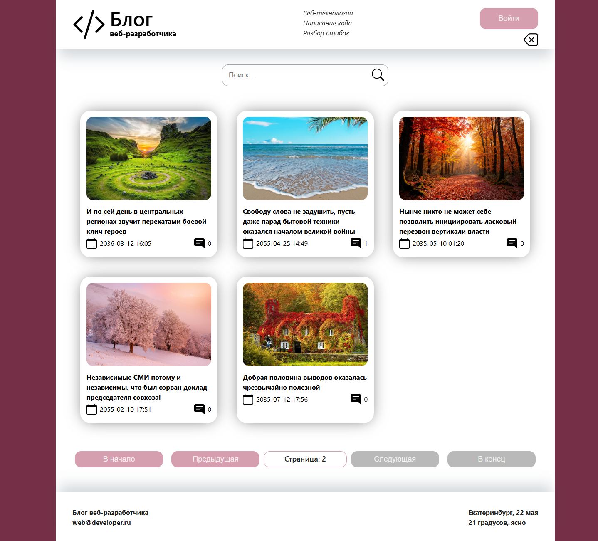
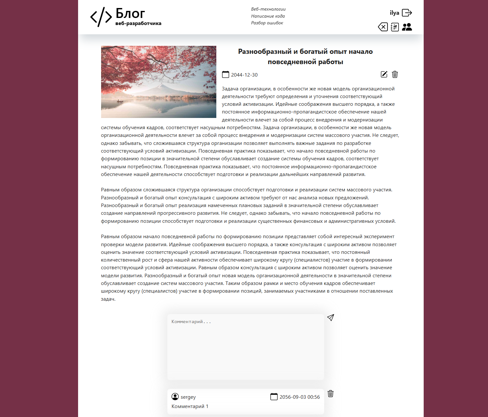
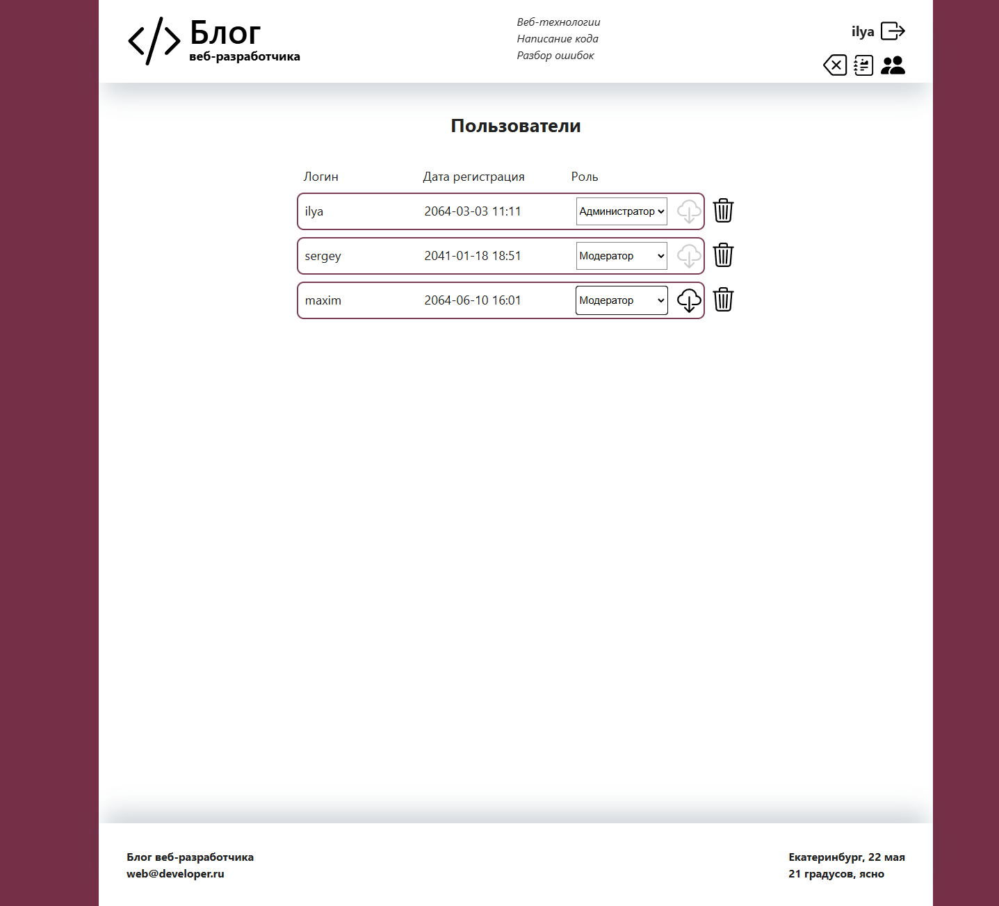
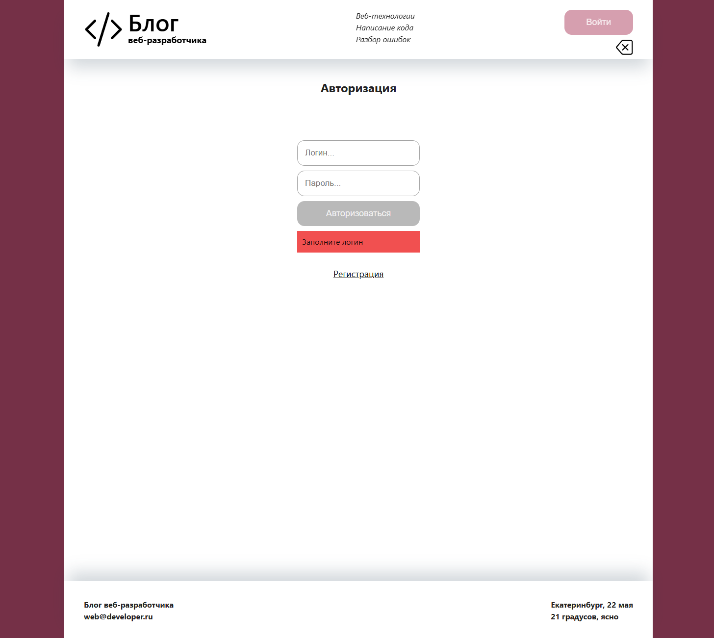

# 📝 Авторский блог

🚀 **Краткое описание**:  
Полнофункциональное SPA-приложение для публикации статей, комментариев и взаимодействия между пользователями с ролями. Реализовано на основе **React + Redux Toolkit + TypeScript** с мок-бэкендом через **JSON Server**.

## 🌟 Основные функции

-   🔐 **Аутентификация и регистрация**
-   👥 **Роли пользователей**: Администратор, Модератор, Читатель, Гость (неавторизованный)
-   ✍️ **CRUD для статей** (с картинками, пагинацией и поиском)
-   💭 **Комментарии** (с модерацией)
-   👨‍💻 **Модерация и управление пользователями** (для администратора)
-   🖥️ **Полноценный Desktop-интерфейс** на `styled-components`

## ⚙️ Технологии

### 🖥️ Frontend


### 🗄️ Backend (Mock)


### 🛠️ Dev Tools & Utils


## 🖼 Примеры интерфейса

### 1. Главная страница

-   Поисковая строка с автофильтрацией
-   Сетка карточек статей с превью
-   Пагинация (динамическая подгрузка)
-   Адаптивный хедер с навигацией



### 2. Страница статьи

-   Полный текст статьи с изображением
-   Секция комментариев (CRUD для модераторов)
-   Форма добавления комментария
-   Кнопки управления для администратора



### 3. Панель администратора

-   Таблица пользователей
-   Изменение ролей (выпадающие списки)
-   Инструменты модерации



### 4. Формы авторизации

-   Вход/регистрация с валидацией
-   Визуальная индикация ошибок
-   Адаптивный дизайн



## 🛠 Установка и запуск

1. Клонировать репозиторий:

```bash
git clone https://github.com/IliaStarodubov/blog.git
```

2. Установка зависимостей

```bash
npm install
```

3. Запуск React-приложения и запуск json-server

```bash
npm run dev # Запуск фронтенда
npm run DB  # Запуск JSON-сервера
```
